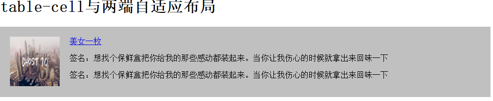
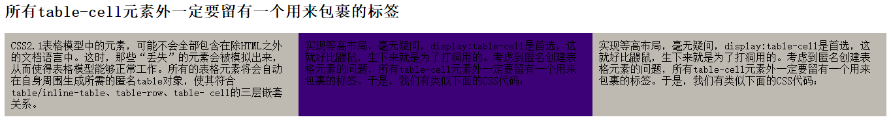

display:table-cell 属性指让标签元素以表格单元格的形式呈现

与其他一些display属性类似，table-cell同样会被其他一些CSS属性破坏，例如float, position:absolute，所以，在使用display:table-cell与float:left或是position:absolute属性尽量不用同用。设置了display:table-cell的元素对宽度高度敏感，对margin值无反应，响应padding属性，基本上就是活脱脱的一个td标签元素了。


2.display:table-cell与大小不固定元素的垂直居中
```
<div class="td">
<div class="dt">
<p>我们都知道，单元格有一些比较特别的属性，例如元素的垂直居中对齐，关联伸缩等，所以display:table-cell还是有不少潜在的使用价值的，虽说IE6/7不支持此属性，但是幸运的是，IE6/7一些乱糟糟的属性与渲染，我们可以其他方法实现同样或是类似的效果。<p>
</div>
</div>
.td{
  width:500px;
  height:500px;
  border:1px solid red;
  display:table-cell;
  vertical-align:middle;
}
.dt{
  display:inline-box;
  vertical-align:middle;
}
```
---
### 2.table-cell 与自适应布局；
````
<div class="box">

<div class="cell">
    <a href="#">美女一枚</a>
    <p>签名：想找个保鲜盒把你给我的那些感动都装起来。当你让我伤心的时候就拿出来回味一下</p>
    <p>签名：想找个保鲜盒把你给我的那些感动都装起来。当你让我伤心的时候就拿出来回味一下</p>
</div>
</div>
css
.box {
 width: 70%;
 background: #c0c0c0;
 padding: 20px; }
 .box img {
   float: left;
   margin-right: 20px; }
 .box .cell {
   display: table-cell;
   *display: inline; }
````

> 其中头像部分使用了float属性，左浮动，IE8+以及Firefox、Chrome、Opera等现代浏览器右侧使用了display:table-cell属性，结果就自适应了，很简单的代码，很神奇的效果。

>对于IE6 IE7不认识table-cell 使用display:inline-box;

在本例demo中，右侧内容足够多，所以宽度完整的撑开了，如果内容有限，则宽度就是内容的宽度，此时想要让某个元素（例如关闭按钮）右侧定位就会有问题，解决方法就是定义一个非常宽的宽度，就像上面facebook截图中的CSS属性一样，所以，考虑到各种情况，更健壮耐用的CSS代码应如下：
>display:table-cell;*display:inline-box;width:2000px;*width:auto;
>display:table-cell;width:2000px;*width:auto; *zoom:1

---
table表格中的单元格最大的特点之一就是同一行列表元素都等高。所以，很多时候，我们需要等高布局的时候，就可以借助display:table-cell属性。说到table-cell的布局，不得不说一下“匿名表格元素创建规则”：
>CSS2.1表格模型中的元素，可能不会全部包含在除HTML之外的文档语言中。这时，那些“丢失”的元素会被模拟出来，从而使得表格模型能够正常工作。所有的表格元素将会自动在自身周围生成所需的匿名table对象，使其符合table/inline-table、table-row、table-
cell的三层嵌套关系。

实现等高布局，毫无疑问，display:table-cell是首选，这就好比鼹鼠，生下来就是为了打洞用的。考虑到匿名创建表格元素的问题，所有table-cell元素外一定要留有一个用来包裹的标签。于是，我们有类似下面的CSS代码：

````
<div class="table-row">
    <div class="table-cell">CSS2.1表格模型中的元素，可能不会全部包含在除HTML之外的文档语言中。这时，那些“丢失”的元素会被模拟出来，从而使得表格模型能够正常工作。所有的表格元素将会自动在自身周围生成所需的匿名table对象，使其符合table/inline-table、table-row、table- cell的三层嵌套关系。</div>
    <div class="table-cell table-center">实现等高布局，毫无疑问，display:table-cell是首选，这就好比鼹鼠，生下来就是为了打洞用的。考虑到匿名创建表格元素的问题，所有table-cell元素外一定要留有一个用来包裹的标签。于是，我们有类似下面的CSS代码：</div>
    <div class="table-cell">实现等高布局，毫无疑问，display:table-cell是首选，这就好比鼹鼠，生下来就是为了打洞用的。考虑到匿名创建表格元素的问题，所有table-cell元素外一定要留有一个用来包裹的标签。于是，我们有类似下面的CSS代码：</div>
</div>
css

.table-row {
  display: table-row;
  background: red; }

.table-cell {
  display: table-cell;
  width: 30%;
  padding: 10px;
  background: #beb9b1; }

.table-center {
  background: #3c0077; }
````

