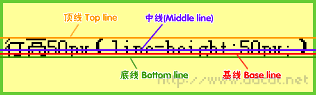
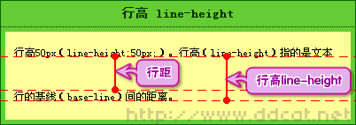
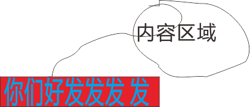
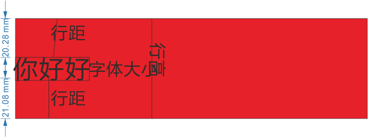
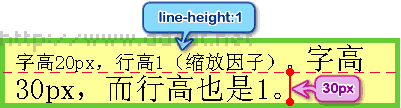
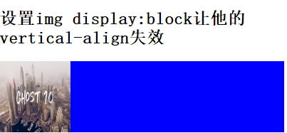
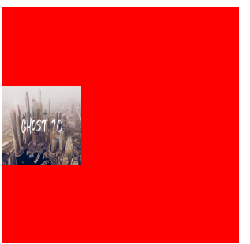
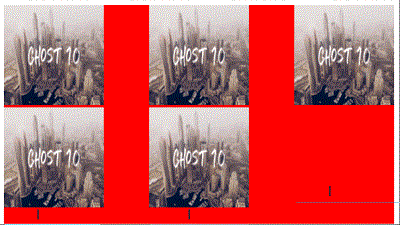
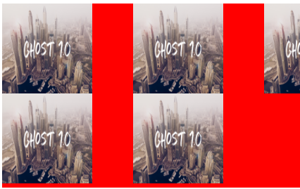

### vertical-align
所有浏览器都支持 vertical-align 属性。
vertical-align 属性设置元素的垂直对齐方式。
明
该属性定义行内元素的基线相对于该元素所在行的基线的垂直对齐。允许指定负长度值和百分比值。这会使元素降低而不是升高。在表单元格中，这个属性会设置单元格框中的单元格内容的对齐方式。
> 所以 vertical-align 对display 为inline inline-block table table-cell有效

* 百分值 – %	通过距离（相对于1line-height1值的百分大小）升高（正值）或降低（负值）元素。'0%'等同于'baseline'
* baseline	默认。元素的基线与父元素的基线对齐。
* sub	降低元素的基线到父元素合适的下标位置。
* super	升高元素的基线到父元素合适的上标位置。
* top	把对齐的子元素的顶端与line box顶端对齐。
* text-top	把元素的顶端与父元素内容区域的顶端对齐。
* middle	元素的中垂点与 父元素的基线加1/2父元素中字母x的高度 对齐。
* bottom	把对齐的子元素的底端与line box底端对齐。
* text-bottom	把元素的底端与父元素内容区域的底端对齐。
* inherit	采用父元素相关属性的相同的指定值。

***
### line-height
行高指的是文本行的基线间的距离。而基线（Base line），指的是一行字横排时下沿的基础线，基线并不是汉字的下端沿，而是英文字母x的下端沿，同时还有文字的顶线（Top line）、中线（Middle line）和底线（Bottom line），用以确定文字行的位置,

>baseline 跟行高有关，距bottom较近
> middleline也据baseline较近并不是在父元素居中

行高与字体尺寸的差称为行距（leading>

#### 内容区域、行内框和行框
理论上讲，一行中的每个元素都有一个内容区域，它是由字体尺寸决定的


行内元素会生成一个行内框（inline box），行内框只是一个概念，它无法显示出来，但是它又确实存在。在没有其他因素影响的时候，行内框等于内容区域，而设定行高则可以增加或者减少行内框的高度，即：将行距的值（行高-字体尺寸）除以2，分别增加到内容区域的上下两边，如图7-20所示。



这里又有一个新的概念――行框（line box）。同行内框类似，行框是指本行的一个虚拟的矩形框，其高度等于本行内所有元素中行高最大的值。因此，当有多行内容时，每行都会有自己的行


> 行框的高度只同本行内元素的行高有关，而和父元素的高度（height）无关
### 行高的计算与继承
以em、ex和百分比为单位的行高，其基数是元素本身的字体尺寸。例如有代码如下：
```
<span style="font-size:15px;line-height:3em">hello</span>
line-height=3*15=45px;
leading=45-15/2=15px;
```
行高可以设定得比字体高度小，此时多行的文字将叠加到一起
行高是可继承的，但是继承的是计算值
```
<p>字高20px<span>字高30</span></p>
p{
  font-size:20px;
  line-height:2em=>40px;
}
元素的行高2em，字体尺寸为20px，因此计算值为40px，虽然<span>元素本身的字体尺寸为30px，
不过其继承的行高仍为40px。但是在不同的浏览器内显示的效果却不尽相同
```
>由于继承的是计算值，因此当元素内的文字字体尺寸不一样的时候，如果设定固定的行高很可能造成字体的重叠

为了避免这种情况，可以为每个元素单独定义行高，但是这样很烦琐，因此可以定义一个没有单位的实数值作为缩放因子来统一控制行高，缩放因子是直接继承的，而不是继承计算值。例如修改上例中的行高为：
```
<p>字高20px，行高1em，当文本为多行时可能会发生文字重叠的想象。
<span>字高30px。</span></p>
p{
  line-height:1;

}
span{
  font-size:30px;
}
```


当内容中含有图片的时候，如果图片的高度大于行高，则含有图片行的行框将被撑开到图片的高度
> 意：图片虽然撑开了行框，但是不会影响行高，因此也不会影响到基于行高来计算的其他属性。
提示：当行内含有图片的时候，图片和文字的垂直对齐方式默认是基线对齐，关于垂直

应用：单行文字在垂直方向居中


一般只需要设定与高度相等的行高
垂直居中了

----
### line-height与 vertical的关系

 再者关于百分数值，百分值与数值，以我的眼光看去，代表了不同的思想，以及心态。前者代表着灵活，自由与开放，后者有严谨，精确，安稳之意。CSS中支持百分值的属性还不少，例如width/height,line-height,font-size,这里的vertical-align属性也是其一。提到百分值，必然牵扯到相对于那个属性（或值），例如宽度百分比都是相对于父块状元素的宽度值的，font-size的百分值是相对于向外的第一含有font-size属性的层的font-size大小而言的，而这里的vertical-align，有些不拘一格，是相对于此标签继承的line-height值决定的

 所谓inline-block水平的元素，就是既可以“吸”又可以“咬”的元素，既可以与inline水平元素混排，又能设置高宽属性的元素。哪些元素呢，例如图片，按钮，单复选框，单行/多行文本框等HTML控件，只有这些元素默认情况下会对vertical-align属性起作用。
###  使用 vertical-align和line-height垂直居中
```html
<div class="vertical">


</div>
css {
  .vertical{
    display:inline-block;
    width:500px;
    height:500px;
    border:1px solid red;
    line-height:500px;
    vertical-align:middle;
    img{
      vertical-align:middle;
    }
  }
}

```
vertical-align的百分比值不是相对于字体大小或者其他什么属性计算的，而是相对于line-height计算的。举个简单的例子，如下CSS代码：
```
.font{
    font-size: 20px;
    line-height: 3em;
    display: inline-block;

    border: 1px solid red;
}
.square{
    width: 5px;
    height: 5px;
    display: inline-block;
    background: orange;
    vertical-align: 30%;

}
line-height跟字体有关系 而 vertical-align跟line-height有关系
lH=3*20px=60px;
va=60*.3=18px;

```
> line-height  vertical-align撑开block了让图片的bottom和包含块不重合 设font-size:0它影响着行高,vertical-align又受line-height影响 使得baseline和bottom重合
图片下面的间隙，依旧是那个间隙。但是，我们的理解就好理解了。回答下面几个问题，我们就知道表现的原因了：

* vertical-align默认的对齐方式是？
  baseline vertical-align默认值是baseline, 也就是基线对齐。而基线是什么，基线就是字母X的下边缘（参见“字母’x’在CSS世界中的角色和故事”一文）。所以，妹子图片的下边缘就和后面zxx中的字母x下边缘对齐（见下图）。而字符zxx本身是有高度的，对吧，于是，图片下面就留空了。
  
* 后面zxx文字的高度从何而来？

而zxx文字的高度是由行高决定的

### 不想看到图片有间隙解决方法就是让 line-height vertical-align其中一个失效
1.display:block;
vertical-align不支持块元素
```
img{
  display:block;
}
```



---

下面的空隙高度，实际上是文字计算后的行高值和字母x下边缘的距离。因此，只要行高足够小，实际文字占据的高度的底部就会在x的上面，下面没有了高度区域支撑，自然，图片就会有容器底边贴合在一起了。比方说，我们设置行高5像素
> 只要设置line-height<font-size就没有了间隙

```
.inline{
    background: red;
    font-size: 20px;
    line-height: 10px;

}
```
;
* font-size直接影响line-height间接影响vertical-align;

如果line-height是相对单位，例如line-height:1.6或者line-height:160%之类，也可以使用font-size间接控制，比方说来个狠的，font-size设为大鸡蛋0, 本质上还是改变line-height值.

```
.inline{
  font-size:0;
}
```


-----
font-size:0, 因此此时content area高度是0，各种乱七八糟的线都在高度为0的这条线上，绝对中心线和中线重合。自然全垂直居中：
```
div{
  display:inline-block;
  width:300px;
  line-height:300px;
  border:1px solid;
  font-size:0;


}img{
  vertical-align:middle;
}
```

----

### text-align:justify两端对齐布局
```
.justify{
    display: inline-block;
    width: 100%;
    text-align: justify;
    .inline-block{
        width: 130px;
        height: 150px;
        display: inline-block;
        border: 2px solid red;
        text-align: center;
        line-height: 150px;
        font-size: 0;
        vertical-align: middle;

    }
    img{
        width: 120px;
        height:120px;
        vertical-align: middle;
    }
}
```

### 图片列表
```
<div class="list-left">
    <ul>
        <li>
            <div class="img"></div>
            <span>2017/09/06</span>
        </li>
        <li>
            <div class="img"></div>
            <span>2010/09/08</span>
        </li>
        <li>
            <div class="img"></div>
            <span>2090/89/17</span>
        </li>
        <li>
            <div class="img"></div>
            <span>2017/09/08</span>
        </li>
        <li>
            <div class="img"></div>
            <span>20170907</span>
        </li>
    </ul>

</div>
```
```css
.list-left{
    ul{
        margin: 0;
        padding:0;
        list-style: none;
        overflow: hidden;
        li{
            float: left;
            width: 120px;
            height: 150px;
            margin-left: 10px;
            text-align: center;
            span{
                width: 100%;
                display: inline-block;
                text-align: center;
                color: #c0c0c0;
                margin:{
                    top: 5px;
                }
            }
            .img{
                display: table-cell;
                width:120px;
                height: 120px;
                text-align: center;
                vertical-align: middle;
                border: 2px solid blue;
                img{
                    width: 100px;
                    height: 100px;
                    vertical-align: middle;
                }

            }
        }
    }
}
```


----
### justify1
```
<div class="justify1">
    
    
    
    
    
    <i class="justify-fix"></i>
    <i class="justify-fix"></i>
    <i class="justify-fix"></i>


</div>
```
```
scss
.justify1{
    text-align: justify;
    width: 500px;
    background: red;
    img{
        width: 128px;
        height: 128px;

    }
}
.justify-fix{
    display: inline-block;
    width: 128px;
}
```

结果会发现，上面巨大的空隙是由占位i元素上面和下面的间隙共同组成的。

下面问题来了：上面的间隙是如何产生的？下面的间隙是如何产生的？如果去除这些间隙呢？

很多时候，复杂问题是由简单问题组合而成的，实际上，这里的间隙现象的始作俑者和上面的简单现象一样，都是vertical-align和line-height搞基带来的不好的影响。

按照之前问题解决方法，我们可以直接来个line-height:0解决垂直间隙问题：
>.justify1{line-height:0}

