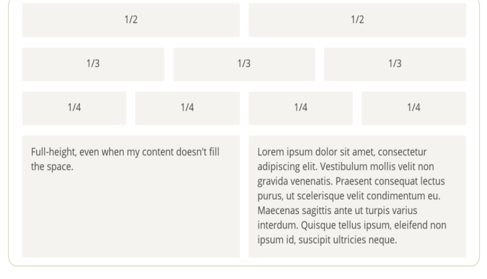
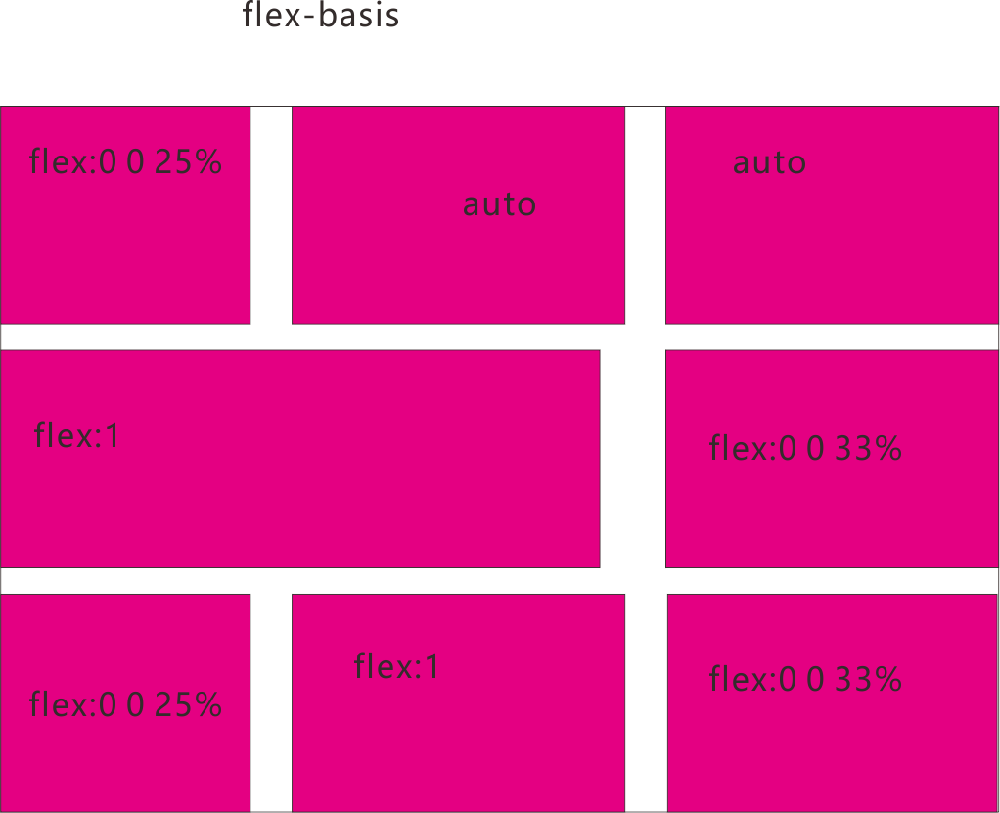
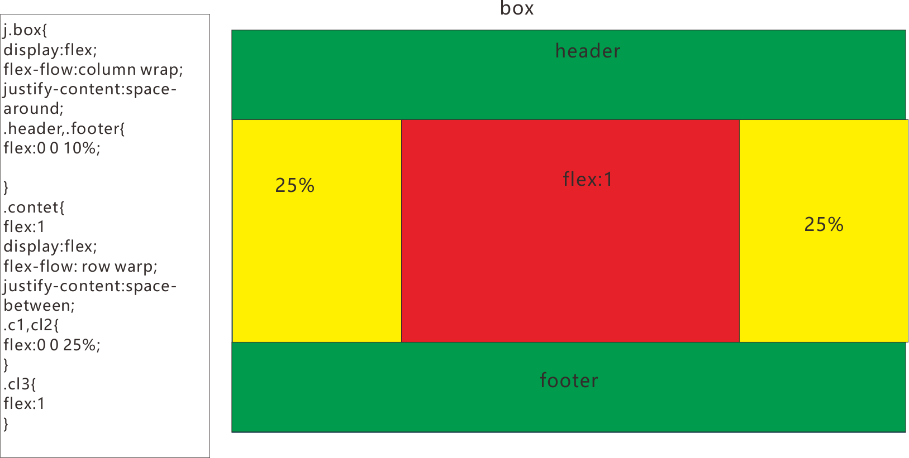
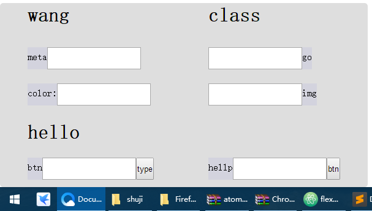

### 骰子的布局

[flex](./html/flex1.html)

### 网络布局
最简单的网格布局，就是平均分布。在容器里面平均分配空间，跟上面的骰子布局很像，但是需要设置项目的自动缩放

```
.g {
  width: 300px;
  height: 400px;
  display: flex;
  flex-flow: row wrap;
  border: 2px solid red;
  justify-content: flex-start;
  align-content: space-between; }
  .g .g1 {
    flex-basis: 100%;
    display: flex;
    flex-flow: row nowrap;
    justify-content: space-around;
    height: 50px; }
    .g .g1 .g-1 {
      height: 50px;
      background: red;
      margin-left: 10px;
      margin-right: 10px;
      flex: 1; }
    .g .g1 .g-2 {
      height: 50px;
      background: red;
      margin-left: 10px;
      margin-right: 10px;
      flex: 1; }
  .g .g2 {
    flex-basis: 100%;
    display: flex;
    flex-flow: row nowrap;
    justify-content: space-around;
    height: 50px; }
    .g .g2 .g-1 {
      height: 50px;
      background: red;
      margin-left: 10px;
      margin-right: 10px;
      flex: 1; }
    .g .g2 .g-2 {
      height: 50px;
      background: red;
      margin-left: 10px;
      margin-right: 10px;
      flex: 1; }
    .g .g2 .g-3 {
      height: 50px;
      background: red;
      margin-left: 10px;
      margin-right: 10px;
      flex: 1; }
  .g .g3 {
    flex-basis: 100%;
    display: flex;
    flex-flow: row nowrap;
    justify-content: space-around;
    height: 50px; }
    .g .g3 .g-1 {
      height: 50px;
      background: red;
      margin-left: 10px;
      margin-right: 10px;
      flex: 1; }
    .g .g3 .g-2 {
      height: 50px;
      background: red;
      margin-left: 10px;
      margin-right: 10px;
      flex: 1; }
    .g .g3 .g-3 {
      height: 50px;
      background: red;
      margin-left: 10px;
      margin-right: 10px;
      flex: 1; }
    .g .g3 .g-4 {
      height: 50px;
      background: red;
      margin-left: 10px;
      margin-right: 10px;
      flex: 1; }
  .g .g4 {
    flex-basis: 100%;
    display: flex;
    height: 100px;
    flex-flow: row nowrap;
    justify-content: space-between; }
    .g .g4 .g-1 {
      height: 100px;
      background: black;
      margin-left: 10px;
      margin-right: 10px;
      flex: 1; }
    .g .g4 .g-2 {
      height: 100px;
      background: black;
      margin-left: 10px;
      margin-right: 10px;
      flex: 1; }
      不管项目多少个都是
      在主轴空间是都是等比例缩放
```
### %布局
```
通过flex-basis在主轴是占的空间百分之几布局项目
```



##（Holy Grail Layout）指的是一种最常见的网站布局。


页面从上到下，分成三个部分：头部（header），躯干（body），
尾部（footer）。其中躯干又水平分成三栏，从左到右为：导航、主栏、副栏
```
当项目设flex-basis空间
存在多个嵌套项目,某个项项目存在一个元素，flex-basis设置占用的空间就
是width,height
交叉轴align-items:stretch占满交叉轴
如果是小屏幕，躯干的三栏自动变为垂直叠加
@media (max-width: 768px) {
.HolyGrail-body {
flex-direction: column;
flex: 1;
} .
HolyGrail-nav,
.HolyGrail-ads,
.HolyGrail-content {
flex: auto;
}
}

```

### 输入框的布局
我们常常需要在输入框的前方添加提示，后方添加按钮
[input](./html/sb.html);

### 固定的底栏
