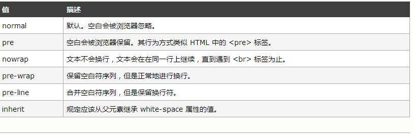

 ### 表单输入绑定
你可以用 v-model 指令在表单控件元素上创建双向数据绑定。它会根据控件类型自动选取正确的方法来更新元素。尽管有些神奇，但 v-model 本质上不过是语法糖，它负责监听用户的输入事件以更新数据，并特别处理一些极端的例子。
```

  v-model 会忽略所有表单元素的 value、checked、selected 特性的初始值。
因为它会选择 Vue 实例数据来作为具体的值。你应该通过 JavaScript 在组件的 data 选项中声明初始值。
```
```
对于要求 IME (如中文、日语、韩语等) (IME 意为“输入法”)的语言，你会发现 v-model 不会在 ime 输入中得到更新。如果你也想实现更新，请使用 input 事件。
```
### #文本
```
<input type="text" v-model="val" >
<p>{{val}}</p>
```
### 多行文本
```
<span>多行文本</span>
<p style="white-space:pre-line">{te}</p>
<texta v-model="te"></texta>
```
>在文本区域插值 (\<textarea>\</textarea>) 并不会生效，应用 v-model 来代替。

 * white-space 属性设置如何处理元素内的空白

 

* normal空白被浏览忽略
* pre 类似\<pre>
* nowrap 不会换行
* pre-wrap保留空白字符序列，正常进行换行
* pre-line 合并空白字符


复选框
```
<input type="radio" v-model="checked">
<span>{{checked}}</span>
```
```
<div id="app">
<input type="text" value="jack" v-model="my">
<label>Jack</label>
<input type="text" value="Wangqi" v-model="my">
<label>Wangqi</label>
<input type="text" value="Wd" v-model="my">
<label>jiDong</label>

</div>
var vm=new Vue({
  el:"#app",
  data:{
    my:[];
  },

  })
  每当他选择一个复选框就把其的value添加到my数组里去，去掉复选的勾my数组减去相应的值
```
### 单选框
```
<div id="example-4">
  <input type="radio" id="one" value="One" v-model="picked">
  <label for="one">One</label>
  <br>
  <input type="radio" id="two" value="Two" v-model="picked">
  <label for="two">Two</label>
  <br>
  <span>Picked: {{ picked }}</span>
</div>

var vm=new Vue({
  el:"#example-4",
  data:{
    picked:""
  }
  })
```

### 选择列表
```html
<div id="app">
<select v-model="ss">
<option disable value="" >请选择</option>
<option>1</option
<option>2</option>
</select>
</div>
```
